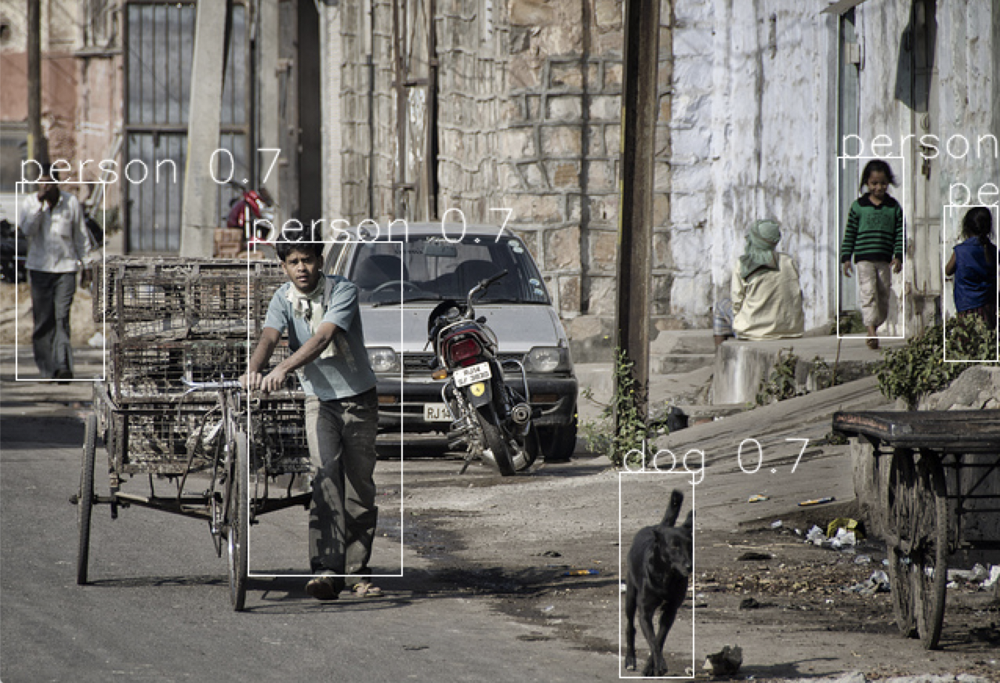
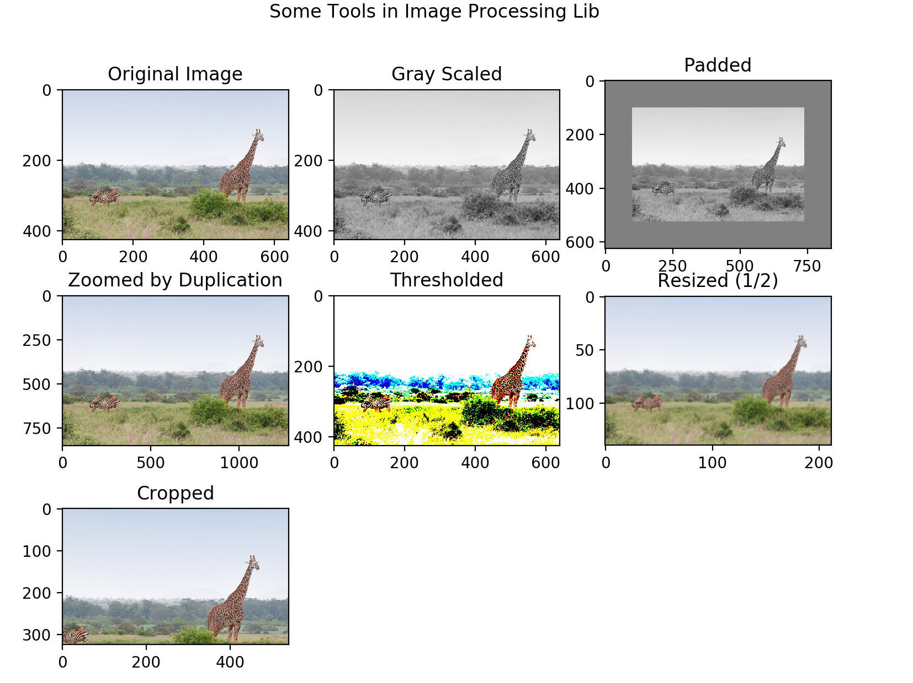
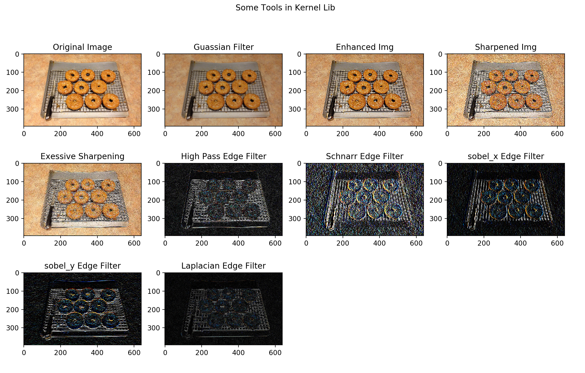
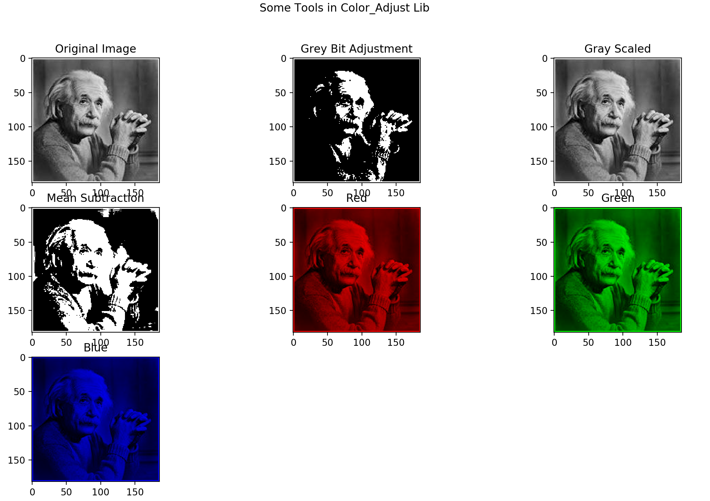
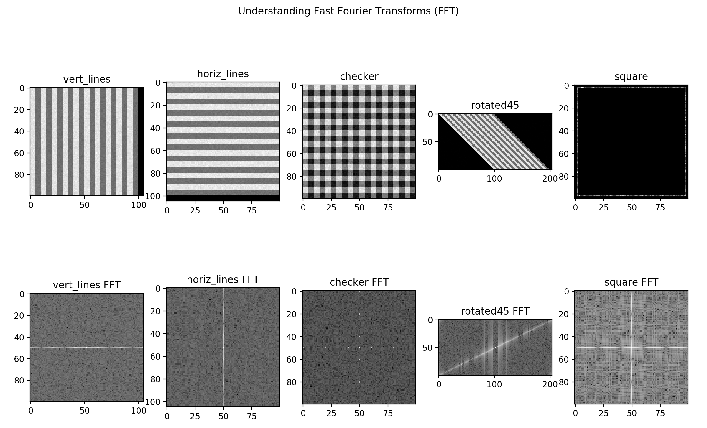
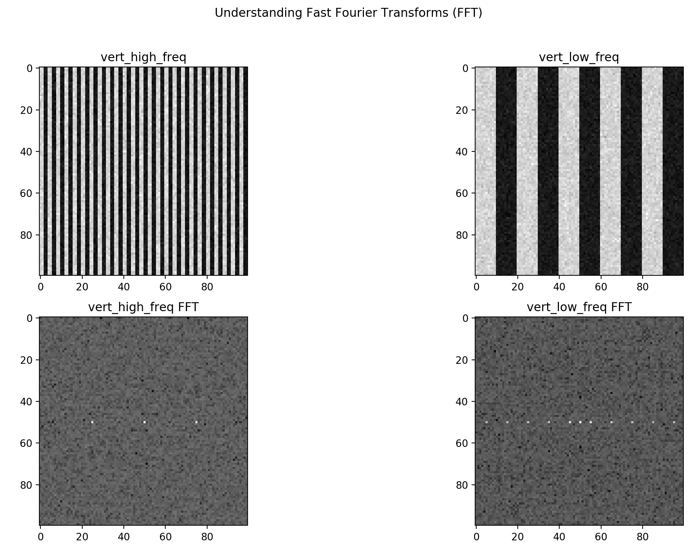
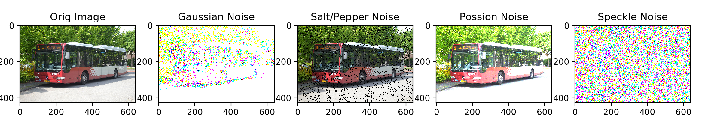
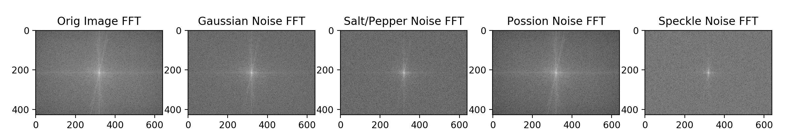

# image-processing-toolkit

(beta)

## Check out [wiki](https://github.com/eddymina/image-processing-toolkit/wiki_ 

This is a simple image processing tool kit. It works by creating useful functions as well making pretrained classifiers easy to use. 

### Face Detection 

Simple face detection module using openCV + caffee pretrained models 
```python
import image_processing as imp
from image_processing  import im_processing,color_adjust 
from image_processing.face_detection import detect_faces #simple DNN/openCV based face detection 

img = imp.im_processing.cv_read('image_processing/face_detection/test2.jpg',RGB=True) #load as RGB image 

detected = detect_faces.detect(img,'image_processing/face_detection/deploy.prototxt.txt',
	'image_processing/face_detection/res10_300x300_ssd_iter_140000.caffemodel',min_conf=.12) #load with appropriate pretrained models

imp.plot_grey(detected) #plot grey will plot as gray scale (matplotlib style) or colored depending on image dims
```

<p align="center"> 

</p>


### Yolo Classification 

Yolo classifier with openCV DNN module with pretrained weights

```python
import image_processing as imp
from image_processing  import im_processing,color_adjust
from image_processing.yolo import yolo #yolo DNN/openCV based 80-class classifier 

img = imp.cv_read('images/img_3.jpg',RGB=True)

detected =yolo.predict(img,model='image_processing/yolo/yolov2.weights', #load with appropriate pretrained models
	config= 'image_processing/yolo/yolov2.cfg')

detected = color_adjust.rgb2bgr(detected) #rgb --> bgr (Can skip this and just used imp.plot_grey() as well) 
imp.cv_plot(detected) #plot using openCV 
```
<p align="center"> 

</p>


## Other Tools 
----

### `im_processing`
General day to day numpy based image manipulation techniques (this is growing
)
```python
import image_processing as imp 
from image_processing  import im_processing,color_adjust #general image processing 
import matplotlib.pyplot as plt

img = imp.cv_read('images/img_10.jpg',RGB=True) #load RGB 

gray= color_adjust.rgb2gray(img) #gray scale 

padded= im_processing.pad_with(gray,pad_len=100,val=128) #pad img with set length and vals (works for colors as well)

zoomed = im_processing.zoom_dup(img,factor=2) #simple zoom by pixel duplication (only ints)

cut = im_processing.cut(img,thresh=128) #vals < thresh = 0 (black) :: vals > thresh = 255 (white)

resized= im_processing.resize(img,img.shape[0]//2,img.shape[1]//2) #reshape image given desired size 

cropped = im_processing.crop(img,x_left=100,x_right=0,y_bot=100,y_up=0) #crop img 

ims= [img,gray,padded,zoomed,cut, resized, cropped]

titles= ["Original Image","Gray Scaled","Padded","Zoomed by Duplication","Thresholded", 
"Resized (1/2)","Cropped"]


imp.im_subplot(ims,shape=[3,3],titles=titles,suptitle="Some Tools in Image Processing Lib") #plot img subplot for comparison 
```

<p align="center"> 

</p>


### `kernel`
Module with a variety of simple kernels ranging from gaussian to image sharpening 

```python 

import image_processing as imp
from image_processing  import im_processing,kernel
import matplotlib.pyplot as plt

img = imp.cv_read('images/img_9.jpg',RGB=True) #load RGB 

guassian = kernel.gaussian_filter(img,kernel_size= 3 ,sigma=1) #guassian filter 

edge = kernel.edge_filter(img) #simple fast edge filter 

high_pass= edge.high_pass()

schnarr= edge.schnarr_filter() #schnarr kernel 

sobel_x= edge.sobel_x() #sobel_x filter 

sobel_y= edge.sobel_y() #sobel_y filter 

laplacian = edge.laplacian()

sharp = kernel.sharpen(img) #sharpening class

enhance = sharp.edge_enhance() #simple edge enhancement 

sharpen = sharp.sharpen() #normal sharpen filted 

extreme = sharp.excessive() #excessive sharpening 

ims= [img,guassian,enhance,sharpen,extreme,high_pass,schnarr,sobel_x,sobel_y,laplacian]

titles= ["Original Image","Guassian Filter","Enhanced Img","Sharpened Img","Exessive Sharpening","High Pass Edge Filter","Schnarr Edge Filter","sobel_x Edge Filter","sobel_y Edge Filter","Laplacian Edge Filter"]

imp.im_subplot(ims,shape=[3,4],titles=titles,suptitle="Some Tools in Kernel Lib") #plot img subplot for comparison 
```

<p align="center"> 

</p>


### `color_adjust`
Color adjustment module with various functions including RGB conversion

```python

import image_processing as imp
from image_processing  import im_processing,color_adjust,im_processing
import matplotlib.pyplot as plt
import numpy as np

img = imp.cv_read('images/einstein.jpg',RGB=True) #load RGB

gray= color_adjust.rgb2gray(img)

R,G,B= color_adjust.color_isolation(img)

dim = np.zeros(img.shape[0:2]).astype(int)
R,G,B=np.stack((R,dim,dim), axis=2),np.stack((dim,G,dim), axis=2),np.stack((dim,dim,B), axis=2)

mean = color_adjust.mean_subtraction(img)

gray_adj = color_adjust.grey_level_adjust(gray,grey_levels=100)


ims= [img,gray_adj,gray,mean,R,G,B]

titles= ["Original Image",'Grey Bit Adjustment',"Gray Scaled",'Mean Subtraction',
"Red", "Green","Blue"]

color_adjust.intensity_plot(im_processing.resize(gray,300,300)) #v


imp.im_subplot(ims,shape=[3,3],titles=titles,suptitle="Some Tools in Color_Adjust Lib") #plot img subplot for comparison 
```

<p align="center"> 

</p>

### `fourier_analysis`
Fourier analysis toolkit with noise introduction, spectral analysis, high/low/pass filters. 


#### Introduction to FFT or Fast Fourier Transforms 

Let 1D fft be define as a 1D_FFT(input) where input is a 1D signal. A 1D FFT computes the discrete frequencies in a signal. Effectively it takes a signal and isolates all the possible frequecies. It can be used for manipulation as seen below

<p align="center"> 

</p>


For more info see my [personal implementation](https://github.com/eddymina/Intro-to-Signal-Processing-in-Python) where I solve the math and code from scratch. 

A 2D FFT is as follows:: 
fft_array = [] 

for row in image:
	fft_array[row] = 1D_FFT(row)

for col in fft_array:
	fft_array[col] = = 1D_FFT(col)


Understanding a 2D FFT

```python
### Observing General FFT Trends 
import image_processing as imp 
from image_processing import fourier_analysis,im_processing

###create an image with black lines  
vert_lines = fourier_analysis.gen_line_im(size=(100,100),samp_freq=5,vert=True,balance = True) 
horiz_lines= fourier_analysis.gen_line_im(size=(100,100),samp_freq=5,vert=False,balance = True) 
checker= fourier_analysis.gen_line_im(size=(100,100),samp_freq=5,checker= True) 
rotated = im_processing.rot45(vert_lines)
box= fourier_analysis.gen_square_im(size=(100,100),n=2,val=1)


ims = [vert_lines,horiz_lines,checker,rotated,box]
ims = [fourier_analysis.im_noise(im).poisson() for im in ims]
titles= ['vert_lines','horiz_lines','checker','rotated45','square']

ims.extend([fourier_analysis.magnitude_spectrum(img) for img in ims]) #get FFT

titles.extend([t +' FFT' for t in titles])


imp.im_subplot(ims,shape=[2,5],titles=titles,
	suptitle='Understanding Fast Fourier Transforms (FFT)')
```

What this script did was add created vertical, horizontal, checkered, and diaganol lined images with a little bit of noise (More detail on noise below. Was done to see clearer FFT's)

General FFT Observations:


<p align="center"> 

</p>

- vertical stripes ~ horizontally-oriented frequencies
- diagonal stripes ~ strong (opposite) diagonal components in FFT
- Images with both horizontal and vertical features have both vertical and horizontal components in FFT

<p align="center"> 

</p>

- high frequencies are far from the origin, lower are closer 


#### Noise Distribution Class :: `im_noise(img)`

- [Gaussian](https://en.wikipedia.org/wiki/Gaussian_noise): add normal distributed noise with set mean and standard deviation | N(mu,sig)

- [Salt & Pepper](https://en.wikipedia.org/wiki/Salt-and-pepper_noise): Replaces random pixels with 0 or 1. Can control amount of noise and ratio of 0/1 (s/p)

- [Poisson](https://en.wikipedia.org/wiki/Poisson_distribution): Poisson Distribution 

- [Speckle](https://en.wikipedia.org/wiki/Speckle_(interference)): img + (img x N(0,1)) where N is gaussian distribution 


```python
import image_processing as imp 
from image_processing import fourier_analysis

img = imp.cv_read(file_path='images/img_0.jpg',RGB=True) #Read RGB

noise= fourier_analysis.im_noise(img) #Noise Class 

ims = [img,noise.gaussian(mean=0,sigma=40), noise.salt_pepper(s_vs_p = 0.5, amount = 0.04),noise.poisson(),noise.speckle()] #add noise to ims

titles= ['Orig Image','Gaussian Noise', 'Salt/Pepper Noise', 'Possion Noise','Speckle Noise']

imp.im_subplot(ims,titles=titles,suptitle='Noise') #compare 

```
<p align="center"> 

</p>

```python
##Continued 

ffts= [fourier_analysis.magnitude_spectrum(img) for img in ims] #get fft 2D

titles= [t+' FFT' for t in titles]

imp.im_subplot(ffts,titles=titles,
	suptitle='Noise Fast Fourier Transforms (FFT)')

```
<p align="center"> 

</p>


#### Stay tuned for further fourier analysis, segmentation, and torch tools 


