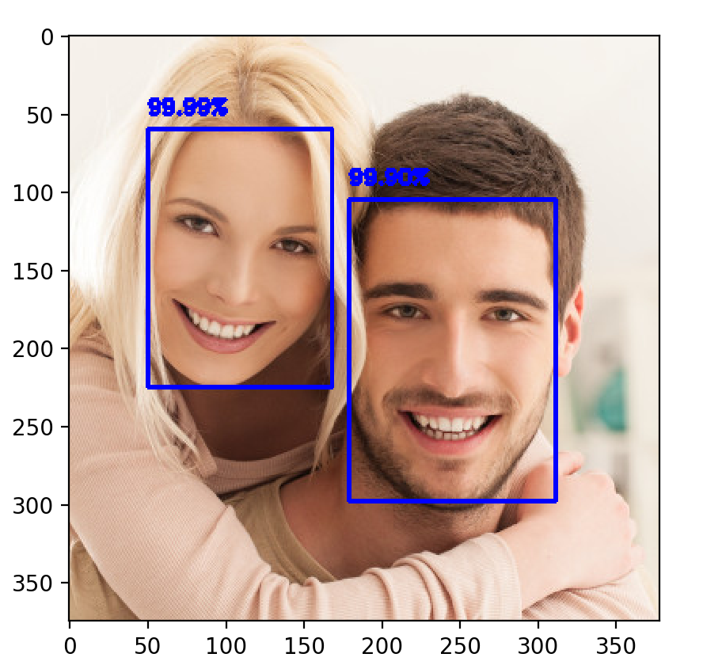

# image-processing-toolkit


This is a simple image processing tool kit. It works by creating useful functions as well making pretrained classifiers easy to use. 

### Face Detection 

Simple face deteection module using openCV + caffee pretrained models 
```python
import image_processing as imp
from image_processing  import im_processing,color_adjust 
from image_processing.face_detection import detect_faces #simple DNN/openCV based face detection 

img = imp.im_processing.cv_read('image_processing/face_detection/test2.jpg') #load as RGB image 

detected = detect_faces.detect(img,'image_processing/face_detection/deploy.prototxt.txt',
	'image_processing/face_detection/res10_300x300_ssd_iter_140000.caffemodel',min_conf=.12) #load with appropriate pretrained models

imp.plot_grey(detected) #plot grey will plot as gray scale (matplotlib style) or colored depending on image dims
```

<p align="center"> 

</p>


### Yolo Classification 

Yolo classifier with openCV DNN module with pretrained weights

```python
import image_processing as imp
from image_processing  import im_processing,color_adjust
from image_processing.yolo import yolo #yolo DNN/openCV based 80-class classifier 

img = imp.im_processing.cv_read('images/img_3.jpg')

detected =yolo.predict(img,model='image_processing/yolo/yolov2.weights', #load with appropriate pretrained models
	config= 'image_processing/yolo/yolov2.cfg')

detected = color_adjust.rgb2bgr(detected) #rgb --> bgr (Can skip this and just used imp.plot_grey() as well) 
imp.cv_plot(detected) #plot using openCV 
```
<p align="center"> 

</p>


## Other Tools 
----

### im_processing
General day to day numpy based image manipulation techniques (this is growing
)
```python
import image_processing as imp 
from image_processing  import im_processing,color_adjust #general image processing 
import matplotlib.pyplot as plt

img = imp.im_processing.cv_read('images/img_10.jpg') #load RGB 

gray= color_adjust.rgb2gray(img) #gray scale 

padded= im_processing.pad_with(gray,pad_len=100,val=128) #pad img with set length and vals (current only works for grays)

zoomed = im_processing.zoom_dup(img,factor=2) #simple zoom by pixel duplication (only ints)

cut = im_processing.cut(img,thresh=128) #vals < thresh = 0 (black) :: vals > thresh = 255 (white)

resized= im_processing.resize(img,img.shape[0]//2,img.shape[1]//2) #reshape image given desired size 

cropped = im_processing.crop(img,x_left=100,x_right=0,y_bot=100,y_up=0) #crop img 

ims= [img,gray,padded,zoomed,cut, resized, cropped]

titles= ["Original Image","Gray Scaled","Padded","Zoomed by Duplication","Thresholded", 
"Resized (1/2)","Cropped"]

plt.suptitle("Some Tools in Image Processing Lib")
imp.im_subplot(ims,shape=[3,3],titles=titles) #plot img subplot for comparison 
```

<p align="center"> 

</p>


### kernel
Module with a variety of simple kernels ranging from gaussian to image sharpening 

```python 
import image_processing as imp
from image_processing  import im_processing,kernel
import matplotlib.pyplot as plt

img = imp.im_processing.cv_read('images/img_9.jpg') #load RGB 

edged= kernel.edge_filter(img) #simple fast edge filter 

guassian = kernel.gaussian_filter(img,kernel_size= 3 ,sigma=1) #guassian filter 

sharp = kernel.sharpen(img) #sharpening class

enhance = sharp.edge_enhance() #simple edge enhancement 

sharpen = sharp.sharpen() #normal sharpen filted 

extreme = sharp.excessive() #excessive sharpening 

ims= [img,edged,guassian,enhance,sharpen,extreme]

titles= ["Original Image","Edge Filter","Guassian Filter",
"Enhanced Img","Sharpened Img", "Exessive Sharpening"]

plt.suptitle("Some Tools in Kernel Lib")
imp.im_subplot(ims,shape=[2,3],titles=titles) #plot img subplot for comparison 
```

<p align="center"> 

</p>


